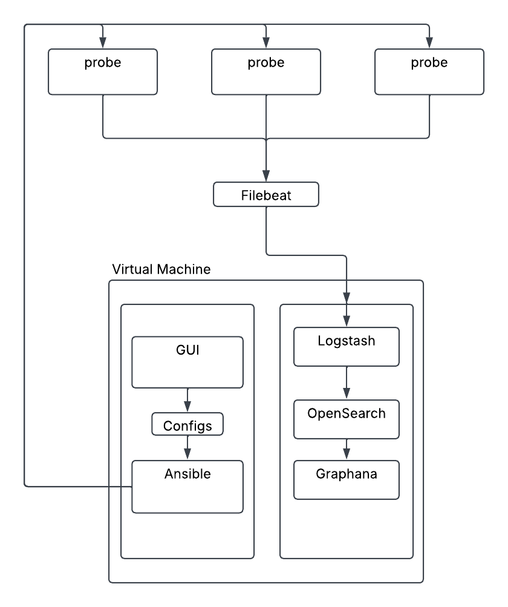
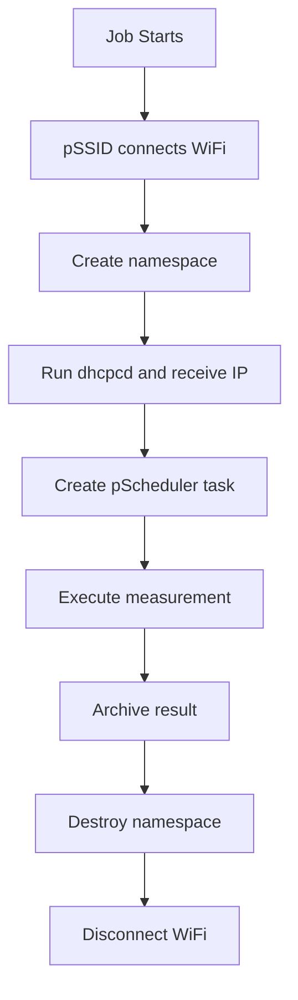

# pSSID Wifi Monitoring Project Report

## 1. Introduction

This document describes the work completed so far on the pSSID network monitoring project. The goal of the project is to deploy a distributed network measurement system capable of collecting, storing, and visualizing network performance metrics.

The system uses Raspberry Pi devices as measurement nodes and integrates:
- pSSID daemon for Wi-Fi monitoring
- pScheduler for active network measurements
- OpenSearch for data storage and indexing
- Grafana for visualisation and dashboards
- Ansible for automated deployment
- GUI for creating configurations for pSSID daemons
    
---

## 2. Project Architecture

The monitoring architecture consists of several components:

The GUI on VM creates needed files such as pssid_config.json and hosts.ini, then daemons are deployed to probes with ansible. The probes produce logs which are shipped back to VM with Filebeat. Logstash receives files, processes them and transform them into a structured format. OpenSearch then stores and indexes the processed logs. Grafana queries OpenSearch to display real-time dashboards, charts, and alerts.

## 3. pSSID Config

The `pssid_config.json` file defines the complete configuration of a pSSID monitoring node.
It is organized into several main sections that describe the monitored devices, network profiles, tests, execution logic, and scheduling.

### 1. Metadata

The `pssid_metadata` section contains information about the configuration file itself, such as its version, generator, and creation timestamp.

 ### 2. Hosts

The `hosts` section defines the monitored pSSID nodes. Each host specifies its identifier (IP address), assigned batches, and the network interface used for measurements (for example, `wlan0`).

### 3. SSID Profiles

The `ssid_profiles` section describes the wireless networks that the node can connect to. It specifies the SSID name and the scripts used to configure the connection at Layer 2 (`wpa_supplicant`) and Layer 3 (`dhcp_client`).

### 4. Tests

The `tests` section defines the network measurements that can be executed.

### 5. Jobs

The `jobs` section groups individual tests into executable tasks. A job can run one or multiple tests, with options controlling execution behavior, such as parallel execution and failure handling.

### 6. Schedules

The `schedules` section defines when jobs are executed using cron expressions. For example, the configuration runs monitoring tasks every 5 minutes.

### 7. Batches

 The `batches` section connects everything together. A batch associates a network interface, SSID profile, schedule, and jobs into a complete monitoring workflow.

Overall, the configuration follows this hierarchy:

Host → Batch → Schedule → Job → Test

The pSSID daemon uses this structure to automatically connect to the configured wireless network and periodically collect network performance metrics.

## 4. PSSID Job Life Cycle

A pSSID measurement job starts by connecting the device to the target Wi-Fi network and creating an isolated namespace. Inside this namespace, DHCP configuration is obtained and pScheduler executes the requested measurements. After the results are archived, the namespace and Wi-Fi connection are released.

## 5. Pscheduler

pScheduler is the task scheduling and execution engine used by PerfSONAR to perform active network measurements between participating hosts. It allows users to create measurement tasks, manages their execution, collects the results, and provides a consistent interface for different measurement tools.

Depending on the configured task, pScheduler can perform tests such as:

- Latency (ping)
- Throughput (iperf3)
- Packet loss (owamp)
 - Traceroute
- MTU discovery
- DNS measurements

In the pSSID project, pScheduler is responsible for creating and executing network measurement tasks after the Raspberry Pi has successfully connected to the target network and obtained an IP address.

## 6. Implemented Tests

Currently, four basic network tests have been implemented:

- HTTP-to-Google test
- RTT-to-Google test
- DNS test
- MTU test

All of these tests can be executed using a single probe, which simplifies the initial implementation and validation process.

---

## 7. Current Problems

During the deployment and testing phase, two main issues were identified:

### 1. Invalid configuration files generated by the GUI

The GUI currently generates invalid configuration files for some tests. This issue has been observed mainly with the RTT and DNS tests, where manual corrections are required before deployment.

This affects automation because the generated configurations cannot be directly used with Ansible without additional modifications.

### 2. Log processing required for Grafana integration

The logs generated by pSSID are stored in JSON format, but all fields are currently interpreted as text values, including numerical metrics.

To allow Grafana to correctly visualize and process the data, additional processing is required in Logstash to convert the appropriate fields into numeric types.

This can be solved by adding specific parsing and type conversion rules to the Logstash configuration.

---

## 8. Next Steps

The following tasks are planned for the next phase of the project:

- Deploy a second Raspberry Pi measurement node.
- Validate end-to-end throughput and latency measurements.
- Expand Grafana dashboards with additional network metrics.
- Automate deployment and configuration using Ansible.
- Perform long-term testing to evaluate measurement stability and reliability.